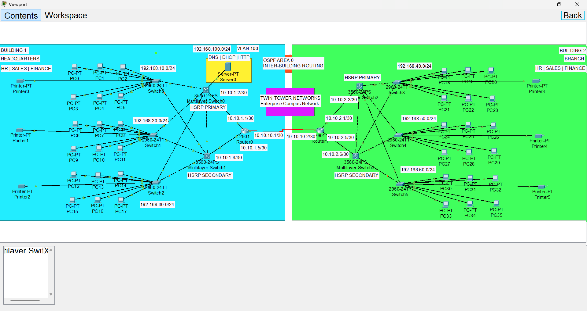
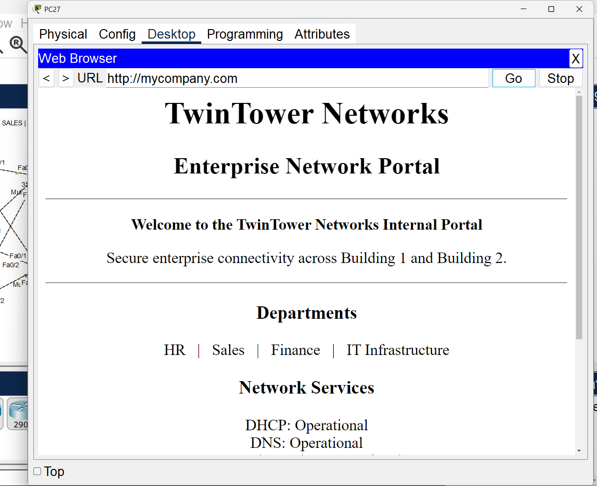
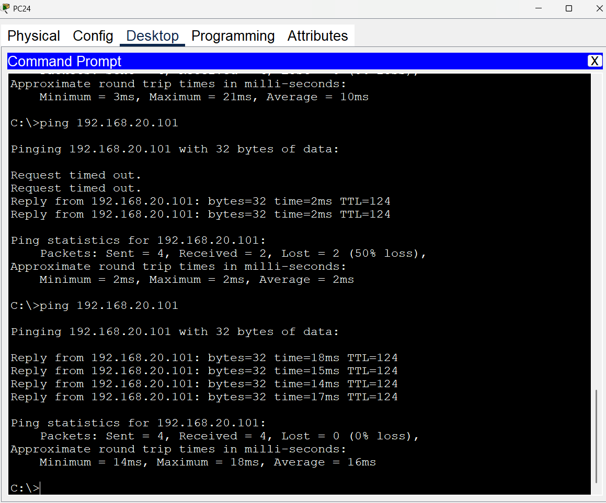

# TwinTower Networks

> A fully simulated two-building enterprise campus network designed and implemented in Cisco Packet Tracer.

## Project Overview

TwinTower Networks is a redundant enterprise network connecting a Headquarters (Building 1) and a Branch Office (Building 2).

The project demonstrates VLAN segmentation, Layer-3 switching, inter-VLAN routing, HSRP gateway redundancy, OSPF dynamic routing, centralized DHCP/DNS/HTTP services, DHCP relay, and end-to-end connectivity testing.

## Network Topology

## Key Features

- VLAN segmentation for HR, Sales, and Finance
- IEEE 802.1Q trunking
- Layer-3 switching using SVIs
- Inter-VLAN routing
- HSRP gateway redundancy
- OSPF Area 0 dynamic routing
- Dedicated Server VLAN 100
- Centralized DHCP
- DHCP relay using `ip helper-address`
- Internal DNS
- Internal HTTP web server
- Two-building enterprise architecture
- End-to-end connectivity testing

## VLAN & IP Addressing

| Building | VLAN | Department | Network | HSRP Gateway |
|---|---:|---|---|---|
| Building 1 | 10 | HR | `192.168.10.0/24` | `192.168.10.1` |
| Building 1 | 20 | Sales | `192.168.20.0/24` | `192.168.20.1` |
| Building 1 | 30 | Finance | `192.168.30.0/24` | `192.168.30.1` |
| Building 2 | 40 | HR | `192.168.40.0/24` | `192.168.40.1` |
| Building 2 | 50 | Sales | `192.168.50.0/24` | `192.168.50.1` |
| Building 2 | 60 | Finance | `192.168.60.0/24` | `192.168.60.1` |
| Both Buildings | 100 | Servers | `192.168.100.0/24` | `192.168.100.1` |

## High Availability

HSRP provides a virtual default gateway for each user VLAN.

- Primary MLS: `.2`
- Secondary MLS: `.3`
- Virtual Gateway: `.1`

Building 1 uses HSRP priority 110 on the primary MLS.

Building 2 uses HSRP priority 210 on the primary MLS.

`preempt` is configured to allow the higher-priority device to resume the active role when appropriate.

## Routing

OSPF Area 0 is used for dynamic routing across the inter-building routed links.

Transit networks:

- `10.10.1.0/30`
- `10.10.1.4/30`
- `10.10.2.0/30`
- `10.10.2.4/30`

## Centralized Server

The dedicated Server VLAN provides:

- DHCP
- DNS
- HTTP

Server configuration:

| Parameter | Value |
|---|---|
| IP Address | `192.168.100.10` |
| Network | `192.168.100.0/24` |
| Gateway | `192.168.100.1` |
| DNS Name | `mycompany.com` |
| Services | DHCP, DNS, HTTP |

## DHCP

A centralized server provides DHCP addressing for the department VLANs.

DHCP provides:

- IP address
- Subnet mask
- Default gateway
- DNS server

DHCP relay is used so that client DHCP requests can reach the centralized server across Layer-3 boundaries.

## DNS & HTTP

Internal DNS maps:

`mycompany.com` → `192.168.100.10`

The internal company portal is accessible through:

`http://mycompany.com`

## Testing & Validation

The completed network was tested for:

- DHCP address assignment
- Inter-VLAN connectivity
- Inter-building connectivity
- HSRP gateway reachability
- OSPF route propagation
- Server reachability
- DNS name resolution
- HTTP access

Example successful connectivity test:

`Packets: Sent = 4, Received = 4, Lost = 0 (0% loss)`

## Evidence

### Internal Web Portal

### Connectivity Test

## Technical Evidence

Additional verification screenshots:

- [04-hsrp-status.png](04-hsrp-status.png) — HSRP active/standby state
- [05-ospf-neighbors.png](05-ospf-neighbors.png) — OSPF neighbor adjacency
- [06-routing-table.png](06-routing-table.png) — Routing table and learned routes
- [07-trunk-status.png](07-trunk-status.png) — 802.1Q trunk and allowed VLANs
- [08-dhcp-client.png](08-dhcp-client.png) — DHCP-assigned client configuration
## Project Files

| File | Description |
|---|---|
| [`TwinTower-Networks.pkt`](./TwinTower-Networks.pkt) | Complete Cisco Packet Tracer project |
| [`COMMANDS.md`](./COMMANDS.md) | Configuration and verification commands |
| [`01-topology.png`](./01-topology.png) | Final enterprise network topology |
| [`02-web-portal.png`](./02-web-portal.png) | Internal DNS/HTTP web portal |
| [`03-connectivity-test.png`](./03-connectivity-test.png) | End-to-end connectivity evidence |

## Technologies

Cisco Packet Tracer · VLAN · 802.1Q · SVI · HSRP · OSPF · DHCP · DHCP Relay · DNS · HTTP · IPv4 Subnetting

## Project Goal

To design and implement a realistic, redundant enterprise campus network integrating network segmentation, high availability, dynamic routing, centralized services, and end-to-end validation across two buildings.
